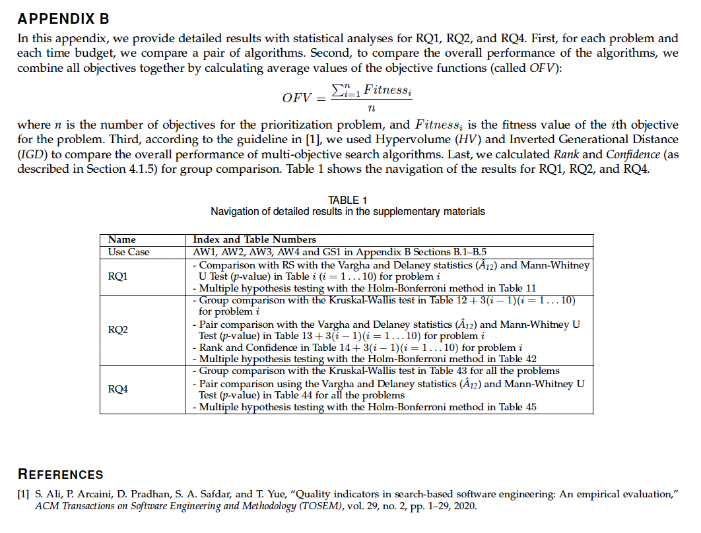

# Uncertainty-Aware Test Prioritization: Approaches and Empirical Evaluation

- [uncertainty-prioritization](uncertainty-prioritization): source code of our tool.
- [uncertaintyprioritization.jar](uncertaintyprioritization.jar): a runnable jar for the tool.
- [Experiment analysis](experiment-analysis/detailed_analysis_results.pdf): detailed analysis results with statistical tests.
- [Example](example/foo.json): an example of uncertainty-wise tests, and such tests are inputs for our approach.

### Get Started

#### Usage: options
```
 -a,--algorithm <arg>       which algorithm you want to employ for
                            priortizing tests (default is SPEA2)
 -d,--dir <arg>             where you want to save results (default is
                            `uncertainty_prioritization_solutions`)
 -f,--testsfile <arg>       [REQUIRED] where you have tests to prioritize
 -r,--repetition <arg>      how many times you want to repeat the
                            experiment (default is 5)
 -s,--strategy <arg>        which strategy you want to employ for
                            priortizing tests (default is 6)
 -t,--timeContraint <arg>   what maximum percentage of time budget you
                            want to apply for (default is 1)

```

#### Example

[foo.json](example/foo.json) represents an example of uncertainty-wise tests that has 5 tests (see `executedUTCs`) and associates with 5 uncertainties (see `alluncertainites`) and 2 indeterminacy sources (see `allIndSs`).

using `-f` to specify where your tests are, then run the command
```command
$ java -jar uncertaintyprioritization.jar -f example/foo.json
```

You will get solutions generated under _default path_, i.e., _uncertainty_prioritization_solutions_. as
```output
Done, solutions can be found under uncertainty_prioritization_solutions
```

#### Used libraries

If you want to build the tool with source code, you need to add libraries as follows

- org.eclipse.emf.common_2.28.0.v20230223-0922.jar
- org.eclipse.emf.ecore_2.33.0.v20230226-0921.jar
- org.eclipse.emf.mapping.ecore2xml_2.12.0.v20230211-1150.jar
- org.eclipse.uml2.common_2.5.0.v20221116-1811.jar
- org.eclipse.uml2.types_2.5.0.v20221116-1811.jar
- org.eclipse.uml2.uml_5.5.0.v20221116-1811.jar
- org.eclipse.uml2_5.5.3.v20221116-1811.jar

### Experimental analysis

In this package, we also provide a [detailed analysis results](experiment-analysis/detailed_analysis_results.pdf) with a navigation as



Raw data is shared on [google drive](https://drive.google.com/file/d/1oXhVR0boBhEXiOv8QBwICtCDH_KyhlgX/view?usp=drivesdk).
